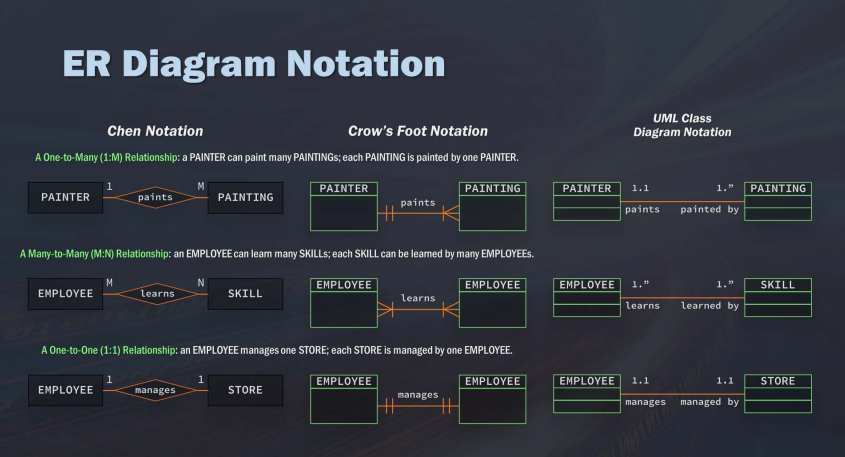
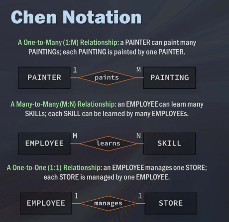
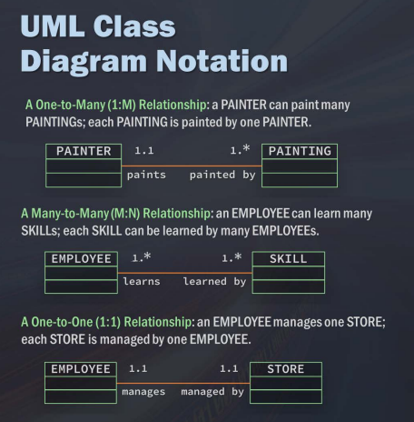
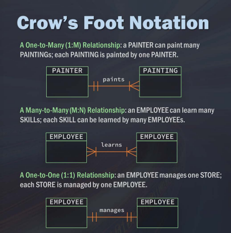
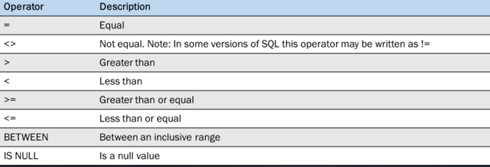

# SQL

SQL = Structured Query Language

Lenguaje de programación usado para comunicarse con la base de datos.

Comunicación entre usted y la base de datos.

Interactuar y comunicarse con los datos.

Se utiliza para consultar, insertar, actualizar y modificar datos.

Para base de datos relacionales.

* Uno a Uno
* Uno a muchos
* Muchos a muchos

---

**Base de datos** = Contenedor (usualmente es un archivo o un conjunto de archivos que se utilizan para organizar y almacenar todos los datos)

Antes de programar
--

¿Cuál problema se intenta resolver?

Unir datos, cuantas columnas.

Populares
--

- SQL Server
- PostgreSQL
- MySQL
- SQL Lite
- NoSQL --> No relacional

---

**Tablas**: Listas estructuradas de elementos de datos

- Filas
- Columnas

**Modelado de datos**: Organizar la información de varias tablas y como se relacionan entre sí

Tipos
--
- Modelo de predicción:

- Modelo de datos: Tablas se representan y organizan en una base de datos

Modelos de base de datos
--

- Relacionales: Muestra relaciones entre las diferentes tablas. 

Optimizar la consulta de datos para que fácil e intuitivos el acceder a los datos.

- Transaccionales: Base de datos más operativa.

---

- Entidad

Ejemplo: persona, lugar, cosa.

- Atributos

Característica de una entidad

Relaciones
--

- 1 - M

1 a muchos

- M - M

Muchos a muchos

- 1-1

1 a 1

---

Diagrama ER



Modelo ER

Otros:






Clave principal: Columna o conjuntos de columnas cuyos valores identifican de forma única cada fila de la tabla.

Claves externas:


---

## SELECT

De que tabla viene:

```SQL
SELECT Nombre_Columna
FROM NombreTabla;
```
Ejemplos:

```SQL
SELECT prod_name
FROM Products;
```

```SQL
SELECT prod_name, prod_id, prod_price
FROM Products;
```

**Seleccionar todas las columnas**

```SQL
SELECT *
FROM Products;
```

### WHERE

```SQL
SELECT columnname, columname
FROM table_name
WHERE colum_name operator value;
```




#### LIMIT

```SQL
SELECT nombre_columna
FROM nombre_tabla
LIMIT numero;
```
En numero va la cantidad de datos que quieres limitar a que aparezcan

Crear Tabla
--

```SQL
CREATE TABLE Shoes
```

Añadir datos
--

```SQL
INSERT INTO Shoes(Id,Brand,Price,valor)
VALUES ('12'
        ,'Gucci'
        ,'Gucci'
        ,'695.00'
        ,NULL);
```
**Primary Key** = Siempre tiene que tener un valor

---

#### TABLA TEMPORAL

```SQL
CREATE TEMPORARY TABLE Sandals AS 
{
    SELECT *
    FROM Shoes
    WHERE Shoe.type = 'Sandals'
}
```

---

Entidad = se almacenan datos (Atributos).

Instancias con valores 

- Modelo lógico
- Modelo conceptual

Tabla -> Modelo físico

1 instancia(Entidad) se relaciona con 1 instancia (Entidad)

1 a 1 Ej: Estudiante <- asiento

1 a M = Entidad débil. Requiere que la otra entidad tenga una instancia.

M a M

Tabla:

Columnas <- instancias

No hay filas duplicadas

**Base de datos Relacional**

- monovalorado: Solo 1 valor

- multivalorado: Ambito de varios valores

Cada atributo <-> tiene un dominio

dominio: Conjunto de valores que puede tener un atributo.